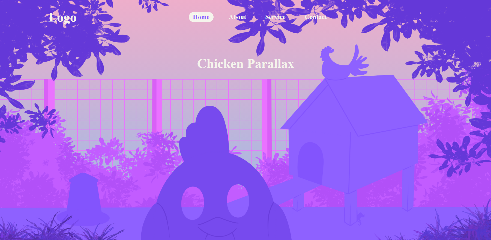

# Création d'un Effet de Parallaxe en React

## Introduction à l'Effet de Parallaxe

L'effet de parallaxe est une technique de conception graphique où les éléments d'arrière-plan se déplacent plus lentement que les éléments de premier plan lors du défilement d'une page web. Cette technique crée une illusion de profondeur et une expérience visuelle dynamique et engageante.

### Historique et Utilisation

Initialement popularisée dans les jeux vidéo pour donner une impression de profondeur dans des environnements bidimensionnels, la parallaxe a été adoptée dans le web design pour améliorer l'interactivité et l'esthétique des sites web.

### Exemple Visuel

Imaginez une page web avec plusieurs couches :

1. **Arrière-plan** : Un coucher de soleil et le grillage.
2. **Plan intermédiaire** : Les feuilles qui s'écartent.
3. **Premier plan** : le titre et un poulet.

Lors du défilement, l'arrière-plan bouge légèrement,  les feuilles du plan intermédiaire bougent un peu plus, et le titre avec le poulet au premier plan bouge le plus rapidement. Ce mouvement différentiel crée une sensation de profondeur et d'immersion.

## Exercice Pratique

### Aperçu GIF + PNG

### Phase 1 : Initialiser votre exercice

1. **Forker le projet GitHub :**

   - Cliquez sur le bouton "Fork" en haut à droite pour créer une copie du dépôt dans votre propre compte GitHub.

2. **Cloner le projet forké :**

   git clone 
   cd Chicken_Parallax
   npm install
   npm run dev  

### Phase 2 : Préparation

1. **Créer le composant ChickenParallax.jsx :**

Créez un fichier nommé ChickenParallax.jsx dans le dossier src.
Ajoutez une balise `<header></header>` dans le return de votre composant.

2. **Créer le fichier CSS ChickenParallax.css :**

Créez un fichier nommé ChickenParallax.css dans le dossier src.
Importez ce fichier CSS dans ChickenParallax.jsx.

3. **Importer le composant dans App.jsx :**

Importez ChickenParallax dans App.jsx.
Placez le composant au-dessus de la div "contentContainer" pour voir les changements en direct.

### Phase 3 : Création de la Nav Bar

1. **Ajouter une Nav Bar dans ChickenParallax :**

Retournez dans le composant ChickenParallax.
Ajoutez une balise `<nav>` à l'intérieur de la balise `<header>`.
Dans la balise `<nav>`, ajoutez une balise `<h2>Logo</h2>` et une balise `<ul>` contenant quatre balises `<li>` (Home, About, Service, Contact).

2. **Styliser la Nav Bar :**

Utilisez la variable CSS --lightShades pour la couleur de la police.
La balise `<header>` doit au moins contenir la propriétés CSS position relative
La balise `<nav>` doit au moins contenir les propriétés CSS suivantes pour le bon fonctionnement du parallaxe :
- position: absolute;
- z-index: 1;

**Explication des Propriétés CSS**

position : 
- La propriété position: relative; est utilisée pour positionner l'élément par rapport à sa position normale sans affecter les autres éléments.
- la position absolute : L'élément est retiré du flux normal et aucun espace n'est créé pour l'élément sur la page. Il est ensuite positionné par rapport à son ancêtre le plus proche qui est positionné (ici, le position: relative sur le header).
z-index : La propriété z-index: 10; définit l'ordre des couches des éléments. Elle est efficace uniquement sur les éléments ayant une propriété CSS position.

### Phase 4 : Positionnement des images

1. **Créer une div pour contenir les éléments mouvants :**

En dessous de votre balise `<nav>`, créez une div avec l'ID #parallaxContainer.
Cette div devra avoir les propriétés CSS suivantes :
position: relative;
width: 100%;
aspect-ratio: 16/9;

2. **Ajouter les images dans la nouvelle div :**

Ajoutez dans cet ordre les images suivantes : fence,un `<h1>`, grass, coop, chicken, leafL et leafR
Chaque élément devra avoir la className parallaxLayer et une position CSS absolute.

**Explication des Propriétés CSS**

aspect-ratio : La propriété CSS aspect-ratio définit un ratio d'affichage préférentiel pour la boîte, assurant que la hauteur de la div est proportionnelle à sa largeur selon un ratio de 16/9.

### Phase 5 : Ajouter le Défilement Parallaxe

Pour ajouter un effet de défilement parallaxe, nous devons suivre le défilement de la page et ajuster la position des éléments en fonction de la position de défilement. Voici comment nous allons le faire en utilisant React.

1. **Créer et Initialiser le useState `offsetY`** :
   
   dans le composant ChickenParallax crée le State :
   const [offsetY, setOffsetY] = useState(0);

    offsetY : C'est une variable d'état qui stocke la position verticale du défilement de la fenêtre.
    setOffsetY : C'est la fonction utilisée pour mettre à jour offsetY.
    useState(0) : Initialise offsetY à 0.

2. **Créer la fonction handleScroll :**

const handleScroll = () => {
    setOffsetY(window.scrollY);
};

handleScroll : Cette fonction est appelée à chaque fois que l'utilisateur fait défiler la page.
setOffsetY(window.scrollY) : Met à jour offsetY avec la position verticale actuelle du défilement de la fenêtre (window.scrollY).

3. **Utiliser useEffect pour attacher et détacher l'écouteur d'événements de défilement :**

useEffect(() => {
    window.addEventListener('scroll', handleScroll);
    return () => {
        window.removeEventListener('scroll', handleScroll);
    };
}, []);

useEffect : Un hook qui permet d'exécuter des effets de bord dans les composants fonctionnels.
window.addEventListener('scroll', handleScroll) : Ajoute l'écouteur d'événements de défilement lorsque le composant est monté.
return () => { window.removeEventListener('scroll', handleScroll); } : Supprime l'écouteur d'événements de défilement lorsque le composant est démonté, pour éviter les fuites de mémoire.

### Phase 6 : Controle du déplacement

Pour chaque balise concernée, ajoutez l'attribut :

`style={{ transform: ``translateX(${offsetY * -0.2}px)`` }}`

Chaque élément qui a ce style est transformé en fonction de offsetY. 
Essayez différentes valeurs positives ou négatives pour ajuster la vitesse et la direction du mouvement. Les éléments doivent avoir des valeurs différentes (vitesse) pour observer l'animation de l'effet parallaxe.

## Remerciements à l'Auteur des Images

Je tiens à remercier chaleureusement l'auteur des images utilisées dans ce projet.

- Les images sont fournies par [cookie_pom_illustration](https://www.instagram.com/cookie_pom_Illustration/).
- Ces images sont utilisées avec la permission de l'auteur et ne sont pas libres de droit.

Merci à l'auteur pour sa générosité et son autorisation d'utilisation de ses magnifiques images.